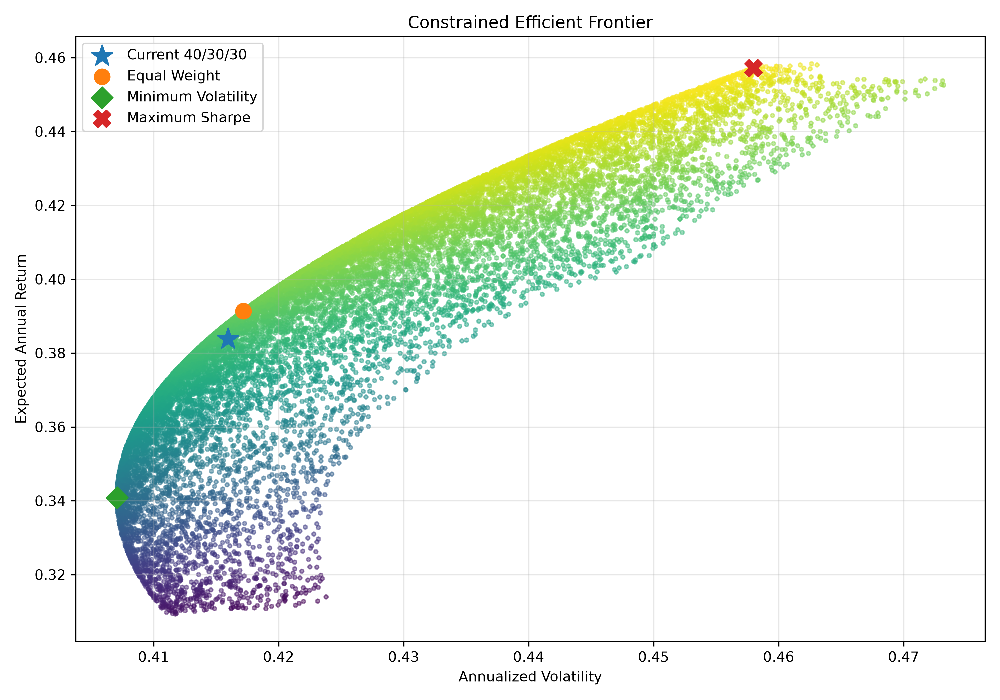
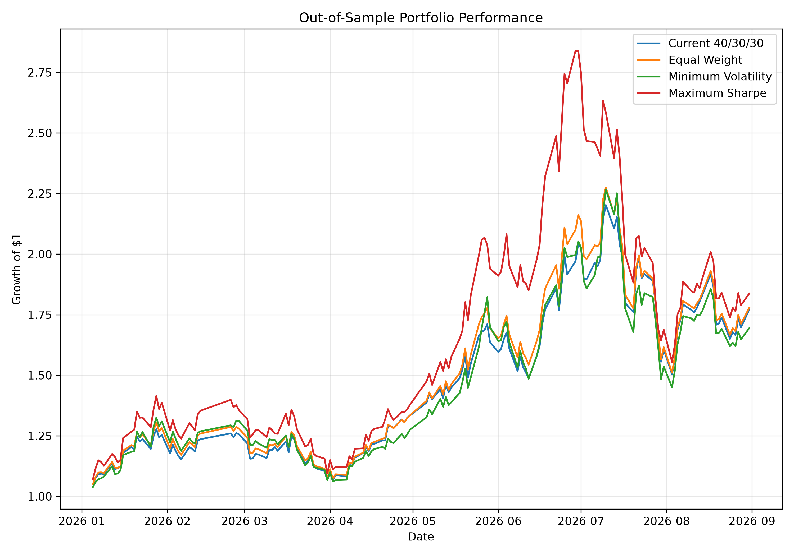
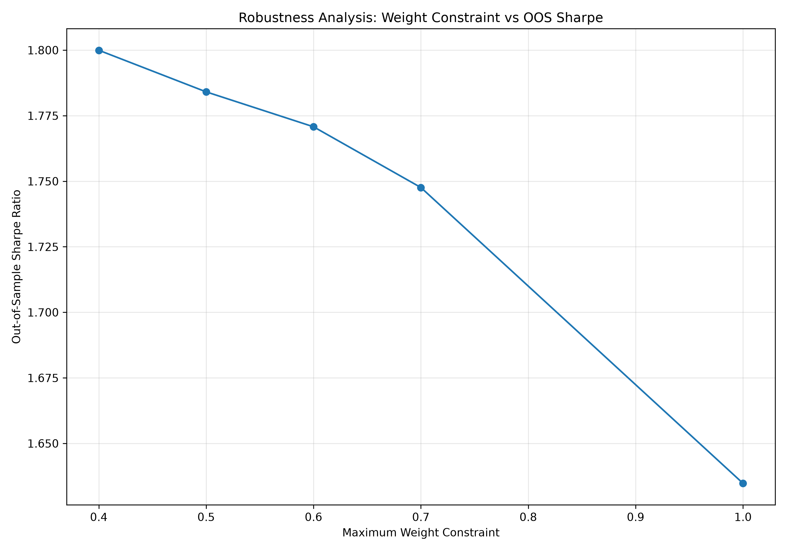

# Quantitative Portfolio Analysis & Optimization

A Python-based quantitative finance project analyzing the risk and performance of a three-stock A-share portfolio, with portfolio optimization, efficient frontier analysis, out-of-sample testing, and robustness analysis.

## Project Overview

This project applies quantitative finance and portfolio theory techniques to analyze a portfolio consisting of three Chinese A-share stocks:

- **ZGC** — 紫光股份 (000938)
- **GDS** — 兆易创新 (603986)
- **HTKJ** — 华天科技 (002185)

The project evaluates portfolio performance and risk under different portfolio construction methods and examines whether optimization results remain stable under out-of-sample testing and different portfolio concentration constraints.

The project was developed using **Python, Pandas, NumPy, SciPy, and Matplotlib**.

## Key Features

- Historical stock price data processing
- Daily return calculation
- Annualized return and volatility analysis
- Covariance and correlation analysis
- Portfolio performance evaluation
- Constrained portfolio optimization
- Efficient frontier simulation
- Out-of-sample portfolio testing
- Portfolio concentration robustness analysis
- Visualization of portfolio risk-return characteristics

## Project Structure

```text
quantitative-portfolio-analysis/
├── data/
│   └── stock_data_a_share.csv
├── figures/
│   ├── constrained_efficient_frontier.png
│   ├── constrained_out_of_sample.png
│   └── robustness_sharpe.png
├── results/
│   ├── constrained_efficient_frontier_data.csv
│   ├── constrained_out_of_sample_results.csv
│   ├── constrained_portfolio_results.csv
│   ├── constrained_training_weights.csv
│   └── robustness_analysis.csv
├── main.py
├── prepare_a_share_data.py
├── README.md
└── .gitignore
```

## Data

Historical daily stock prices were used for the analysis.

The dataset covers:

**January 2023 – August 2026**

with **877 trading days** and **876 return observations** after calculating daily returns.

The three stocks were selected from the user's simulated A-share portfolio.
## Methodology

### 1. Daily Returns

Daily simple returns are calculated as:

$$
R_t = \frac{P_t}{P_{t-1}} - 1
$$

where:

- $P_t$ = closing price on day $t$
- $P_{t-1}$ = closing price on the previous trading day

### 2. Portfolio Return

For a portfolio containing $n$ assets:

$$
R_p = \sum_{i=1}^{n} w_i R_i
$$

where:

- $w_i$ = portfolio weight of asset $i$
- $R_i$ = return of asset $i$

The portfolio is evaluated under several different weighting schemes.

### 3. Portfolio Volatility

Portfolio volatility is calculated using the covariance matrix:

$$
\sigma_p = \sqrt{w^T \Sigma w}
$$

where:

- $w$ = vector of portfolio weights
- $\Sigma$ = covariance matrix of asset returns

### 4. Sharpe Ratio

The Sharpe Ratio is calculated as:

$$
Sharpe = \frac{R_p - R_f}{\sigma_p}
$$

For this project, the risk-free rate is assumed to be:

$$
R_f = 0
$$

This assumption is used for simplicity and should not be interpreted as a market forecast.
## Portfolio Construction

Four portfolio strategies are compared.

### Current Portfolio

The original simulated portfolio allocation:

```text
ZGC   40%
GDS   30%
HTKJ  30%
```

### Equal-Weight Portfolio

Each stock receives an equal allocation:

```text
ZGC   33.33%
GDS   33.33%
HTKJ  33.33%
```

### Minimum-Volatility Portfolio

The portfolio weights are optimized to minimize portfolio volatility.

### Maximum-Sharpe Portfolio

The portfolio weights are optimized to maximize the Sharpe Ratio.

### Portfolio Constraints

To control concentration risk, the optimization is subject to:

$$
\sum_i w_i = 1
$$

and:

$$
0 \leq w_i \leq 60\%
$$

Therefore, no individual stock can account for more than 60% of the portfolio.

The 60% constraint is a modeling assumption used for this project rather than an industry-standard limit.
## Efficient Frontier

The project simulates **20,000 feasible portfolios** under the portfolio constraints.

Each portfolio is evaluated based on:

- Expected annualized return
- Annualized volatility
- Sharpe Ratio

The resulting portfolios are plotted to visualize the relationship between expected return and portfolio risk.



The efficient frontier provides a visual representation of the risk-return trade-off among feasible portfolio allocations.
## Out-of-Sample Testing

To reduce the risk of evaluating an optimized portfolio only on the same data used for optimization, the dataset is divided into training and testing periods.

### Training Period

```text
2023-01-03 – 2025-12-31
```

### Testing Period

```text
2026-01-01 – 2026-08-31
```

The portfolio optimization process is performed using **training-period data only**.

The resulting portfolio weights are then applied to the testing period.

This provides an out-of-sample comparison between:

- Current Portfolio
- Equal-Weight Portfolio
- Minimum-Volatility Portfolio
- Maximum-Sharpe Portfolio

## Out-of-Sample Results

| Portfolio | Total Return | Annualized Return | Volatility | Sharpe Ratio | Max Drawdown |
|---|---:|---:|---:|---:|---:|
| Current | 77.11% | 140.42% | 55.46% | 1.902 | -31.74% |
| Equal Weight | 77.84% | 141.95% | 56.92% | 1.879 | -33.63% |
| Min Volatility | 69.44% | 124.63% | 59.28% | 1.699 | -36.01% |
| Max Sharpe | 83.74% | 154.36% | 66.65% | 1.771 | -45.25% |

> **Note:** The testing period covers only part of 2026. Annualized returns are therefore annualized measures rather than realized full-year returns.


## Robustness Analysis

The project examines how portfolio optimization changes when the maximum allocation allowed to a single stock is varied.

The maximum-weight constraints tested are:

```text
40%
50%
60%
70%
100%
```

As the concentration constraint becomes less restrictive, the optimization tends to allocate a larger proportion of the portfolio to GDS.

The resulting out-of-sample results illustrate a trade-off between portfolio concentration, volatility, and drawdown.

| Maximum Weight | GDS Weight | OOS Total Return | OOS Volatility | OOS Sharpe | Max Drawdown |
|---:|---:|---:|---:|---:|---:|
| 40% | 40.00% | 78.42% | 61.04% | 1.800 | -37.34% |
| 50% | 50.00% | 81.10% | 63.88% | 1.784 | -41.66% |
| 60% | 60.00% | 83.74% | 66.65% | 1.771 | -45.25% |
| 70% | 70.00% | 85.97% | 69.85% | 1.748 | -48.98% |
| 100% | 99.92% | 89.51% | 82.10% | 1.635 | -59.39% |


# Key Findings
## 1. Portfolio optimization is sensitive to constraints

The maximum-Sharpe optimization under a 60% maximum-weight constraint allocated:

### ZGC 12.58% | GDS 60.00% | HTKJ 27.42%

This indicates that portfolio optimization can lead to substantial concentration in a single asset when concentration constraints are relatively loose.

## 2. In-sample optimization does not necessarily translate directly into out-of-sample performance

The maximum-Sharpe portfolio produced a higher historical return than the other tested strategies over the full sample.

However, during the out-of-sample period, its higher return was accompanied by higher volatility and a deeper maximum drawdown compared with the current portfolio.

This highlights the importance of evaluating portfolio strategies beyond in-sample optimization results.

## 3. Concentration constraints affect the risk-return profile

The robustness analysis shows that increasing the maximum allowable allocation to a single stock leads to:

Greater portfolio concentration

Higher out-of-sample volatility

Deeper maximum drawdowns

Lower out-of-sample Sharpe Ratios in this particular test period

This illustrates the role of portfolio constraints in managing concentration risk.

# Technology Stack
## Programming
- Python
## Libraries
- Pandas — data processing and analysis
- NumPy — numerical computation;
- SciPy — constrained portfolio optimization;
- Matplotlib — data visualization;
## Tools
- PyCharm
- Git
- GitHub

# Limitations

This project is designed as a learning and quantitative analysis project rather than a complete investment system.

 Important limitations include:

1. Only three stocks are included in the portfolio.
2. The testing period is relatively short.
3. No transaction costs are incorporated.
4. No market impact or slippage is modeled.
5. Taxes and liquidity constraints are not considered.
6. The risk-free rate is assumed to be zero.
7. The optimization relies on historical return and covariance estimates.
8. The 60% maximum-weight constraint is a modeling assumption.
9. Daily portfolio rebalancing is assumed.
10. Annualized out-of-sample returns should be interpreted cautiously because the testing period does not cover a full year.

# Future Improvements

Potential extensions include:

- Expanding the portfolio to a larger number of stocks
- Incorporating transaction costs 
- Incorporating a non-zero risk-free rate
- Testing alternative portfolio optimization methods
- Adding rolling-window optimization
- Comparing different rebalancing frequencies
- Incorporating factor models
- Adding Value-at-Risk (VaR) and Conditional VaR (CVaR)
- Testing the strategy across different market periods
- Automating data collection from reliable market-data sources

# Conclusion

This project demonstrates the application of quantitative methods to portfolio analysis and optimization.

The workflow covers the complete process from:

Raw Historical Data → Data Cleaning → Return Calculation → Risk & Correlation Analysis → Portfolio Optimization → Efficient Frontier → Out-of-Sample Testing → Robustness Analysis

The project provides practical experience with Python-based financial data analysis, numerical optimization, and portfolio risk assessment.

## Author

## Zhang Lingjia

Financial Mathematics Undergraduate

GitHub: Leona-z